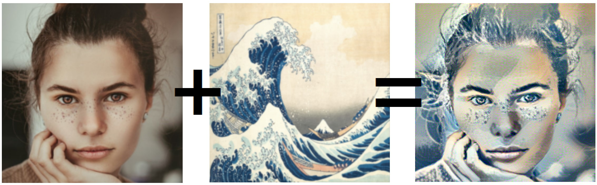

# style_transfer_face

## Abstract
This project seeks to develop a deep learning model for producing pop art. The process involves using a combination of a human face image and a style image. To accomplish this, the project employs transfer learning methods, making use of the pretrained VGG19 model layers in PyTorch. These VGG19 layers are utilized to extract pertinent features from the images.

## Result

## References
[1] Gatys, L. A., Ecker, A. S., & Bethge, M. (1970, January 1). Image style transfer using Convolutional Neural Networks. CVF Open Access. Retrieved April 23, 2023, from https://openaccess.thecvf.com/content_cvpr_2016/html/Gatys_Image_Style_Transfer_CVPR_2016_paper.html

[2] Gonzalez, J. (2017). Man wearing white B-neck shirt. unsplash. Retrieved April 23, 2023, from https://unsplash.com/photos/iFgRcqHznqg.

[3] Nackos, J. (2020). Woman in white crew neck shirt smiling. unsplash. Retrieved from https://unsplash.com/photos/IF9TK5Uy-KI.

[4] Gogh, V. van. (n.d.). The Starry Night. MOMA-Museum of Modern Art. Retrieved from https://www.moma.org/collection/works/79802.

[5] Katsushika , H. (n.d.). Under the Wave off Kanagawa (Kanagawa oki nami ura). The Metropolitan Museum of Art. Retrieved from https://www.metmuseum.org/art/collection/search/45434.

[6] Jacq, A. (n.d.). Neural transfer using pytorch¶. Neural Transfer Using PyTorch - PyTorch Tutorials 2.0.0+cu117 documentation. Retrieved April 23, 2023, from https://pytorch.org/tutorials/advanced/neural_style_tutorial.html

[7] Smiling woman holding cheek. (2019). unsplash. Retrieved from https://unsplash.com/photos/B4TjXnI0Y2c.
